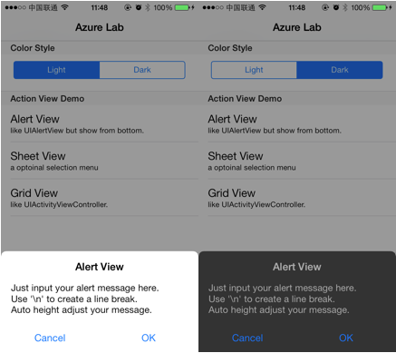
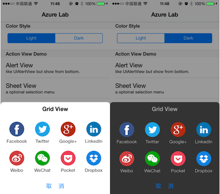
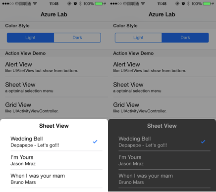

SGActionView
============

##介绍

SGActionView提供三种弹出视图:  

* SGAlertMenu，类似于UIAlertView的提示框。    

* SGGridMenu，多用于选择服务、分享等操作，类似UIActivityViewController的功能  

* SGSheetMenu，一个选项列表，可以设置默认值。    

##使用

引入`SGActionView.h`  

提示框：  
	
	[SGActionView showAlertWithTitle:@"Title"
	                         message:@"Message"
	                     buttonTitle:@"Cancel"
	                  selectedHandle:nil];	

选项列表：  
	
	[SGActionView showSheetWithTitle:@"Sheet View"
	                	   itemTitles:@[ @"Wedding Bell", @"I'm Yours", @"When I Was Your Man" ]
	                   itemSubTitles:@[ @"Depapepe - Let's go!!!", @"Jason Mraz", @"Bruno Mars" ]
	                   selectedIndex:0
	                  selectedHandle:nil];
	                
分享：  
	
	[SGActionView showGridMenuWithTitle:@"Grid View"
	                         itemTitles:@[ @"Facebook", @"Twitter", @"Google+", @"Linkedin",
	                                       @"Weibo", @"WeChat", @"Pocket", @"Dropbox" ]
	                             images:@[ [UIImage imageNamed:@"facebook"],
	                                       [UIImage imageNamed:@"twitter"],
	                                       [UIImage imageNamed:@"googleplus"],
	                                       [UIImage imageNamed:@"linkedin"],
	                                       [UIImage imageNamed:@"weibo"],
	                                       [UIImage imageNamed:@"wechat"],
	                                       [UIImage imageNamed:@"pocket"],
	                                       [UIImage imageNamed:@"dropbox"]]
	                     selectedHandle:nil];

## Third Party Bindings

### React Native
You may now use this library with [React Native](https://github.com/facebook/react-native) via the module [here](https://github.com/prscX/react-native-bottom-action-sheet)

## License
The MIT License (MIT)

Copyright (c) [2014] [Sagi]

Permission is hereby granted, free of charge, to any person obtaining a copy
of this software and associated documentation files (the "Software"), to deal
in the Software without restriction, including without limitation the rights
to use, copy, modify, merge, publish, distribute, sublicense, and/or sell
copies of the Software, and to permit persons to whom the Software is
furnished to do so, subject to the following conditions:

The above copyright notice and this permission notice shall be included in all
copies or substantial portions of the Software.

THE SOFTWARE IS PROVIDED "AS IS", WITHOUT WARRANTY OF ANY KIND, EXPRESS OR
IMPLIED, INCLUDING BUT NOT LIMITED TO THE WARRANTIES OF MERCHANTABILITY,
FITNESS FOR A PARTICULAR PURPOSE AND NONINFRINGEMENT. IN NO EVENT SHALL THE
AUTHORS OR COPYRIGHT HOLDERS BE LIABLE FOR ANY CLAIM, DAMAGES OR OTHER
LIABILITY, WHETHER IN AN ACTION OF CONTRACT, TORT OR OTHERWISE, ARISING FROM,
OUT OF OR IN CONNECTION WITH THE SOFTWARE OR THE USE OR OTHER DEALINGS IN THE
SOFTWARE.
